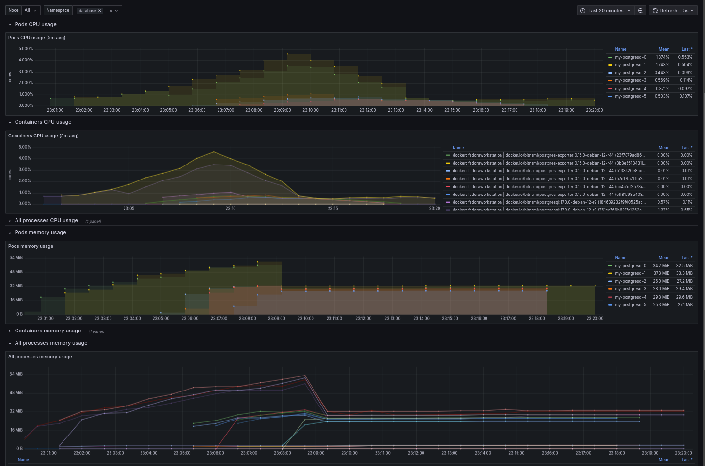

# K3s Cluster with Horizontal Scaling and PostgreSQL ⚡️

This repository provides an automated setup for a lightweight Kubernetes cluster using K3s. It includes monitoring, horizontal scaling, and a PostgreSQL database for managing workloads efficiently. Follow along to see how K3s works with agents, scales out with new hardware, and distributes workloads with PostgreSQL effectively.

## 🛠️ What is K3s?

[K3s](https://k3s.io/) is a lightweight Kubernetes distribution designed to run on resource-constrained devices and edge environments. It is perfect for users who need Kubernetes in a simplified setup. In this repository, K3s serves as the core orchestrator that enables:

- Lightweight deployment 🛫
- Horizontal scaling ⬆️⬇️
- Easy agent management 🤖

## 🎉 How K3s Works with Agents

</img>
Source : https://docs.k3s.io/architecture

K3s works in a server-agent model where:

- **Server**: Acts as the Kubernetes control plane, managing the cluster state and workloads.
- **Agent**: Handles the execution of workloads across nodes. This enables adding new nodes easily, which automatically join the cluster.

By leveraging K3s agents, you can add new hardware to the cluster to accommodate increasing workloads. Each agent contributes additional compute resources, ensuring the cluster scales as demand grows.

## 🚀 Horizontal Scaling with New Hardware

The beauty of Kubernetes (and K3s) lies in its ability to **scale horizontally**. When the workload increases:

- New agents can be added to expand the cluster capacity.
- Pods are distributed across all nodes to ensure workload distribution and load balancing.

With K3s, scaling becomes as simple as adding new machines as agents, which allows for dynamic management of compute resources.

## 🏦 Horizontal Pod Autoscaler (HPA)

The **Horizontal Pod Autoscaler (HPA)** allows Kubernetes to automatically adjust the number of pods in a StatefulSet based on metrics like **CPU** and **memory** usage. In this repository, we set up HPA to dynamically manage the number of PostgreSQL pods:

- **Target CPU utilization**: The HPA scales based on CPU usage thresholds.
- **Min/Max replicas**: It ensures there is always a minimum of 1 and up to 6 replicas, depending on the load.

When workload increases, HPA creates new pods to meet demand, and when the load decreases, HPA scales down the number of running pods to conserve resources.

## 💡 How Scaling In/Out Works

- **Scaling Out**: When CPU or memory metrics indicate an increase in demand (e.g., during load testing), the HPA spins up more replicas of the database pods, up to the maximum limit defined.
- **Scaling In**: When demand falls below a certain threshold, the HPA reduces the number of pods to save resources, ensuring optimal operation at all times.

This auto-scaling process ensures that the database service remains highly available and cost-efficient, without manual intervention.

## 🏦 PostgreSQL Scaling: Query Distribution

The PostgreSQL setup includes **Primary** and **Replica** services to manage queries efficiently:

- **Write Requests** 📝: Sent to the **primary** instance. This ensures all writes are managed in one place, maintaining consistency.
- **Read Requests** 📖: Handled by **read replicas**. This allows multiple read requests to be distributed across replicas, balancing the workload and improving response time.

The **Load Test** script (`load_test.py`) creates a mix of read and write operations to simulate real-world usage, demonstrating how PostgreSQL can handle concurrent access from multiple threads.

## 🚀 Getting Started

To deploy the cluster:

1. **Install K3s** 🤖:
   - Run the `install.sh` script to install K3s and Helm.

2. **Setup Monitoring** 📈:
   - Use `setup_monitoring.sh` to install Prometheus and Grafana for cluster monitoring.

3. **Setup PostgreSQL** 🍎:
   - Execute `setup_database.sh` to deploy a scalable PostgreSQL cluster with monitoring enabled.

4. **Load Testing** 🌐:
   - Run `load_test.py` to generate load and see autoscaling in action.

</img>

### ⭐ Features
- **K3s Cluster Setup**: A lightweight Kubernetes distribution ideal for edge and IoT environments.
- **Prometheus & Grafana Monitoring**: Real-time monitoring of resource usage.
- **PostgreSQL High Availability**: A scalable setup with primary and read replica configurations.
- **Horizontal Scaling**: Autoscaling capabilities to handle fluctuating workloads automatically.

## 🎯 Summary
This project showcases how to deploy a Kubernetes cluster with K3s, set up PostgreSQL for horizontal scaling, and use HPA to manage workloads effectively. The integration with monitoring tools like Prometheus and Grafana gives visibility into cluster health, while autoscaling ensures optimal resource usage.

Happy scaling! 🚀🚀🚀

---

For questions or contributions, feel free to open an issue or submit a pull request. ✨

<!-- CONTACT -->

## Contact

### Martin Karlsson

LinkedIn : [martin-karlsson][linkedin-url] \
Twitter : [@HelloKarlsson](https://twitter.com/HelloKarlsson) \
Email : hello@martinkarlsson.io \
Webpage : [www.martinkarlsson.io](https://www.martinkarlsson.io)

<!-- MARKDOWN LINKS & IMAGES -->
[linkedin-shield]: https://img.shields.io/badge/-LinkedIn-black.svg?style=for-the-badge&logo=linkedin&colorB=555
[linkedin-url]: https://linkedin.com/in/martin-karlsson
